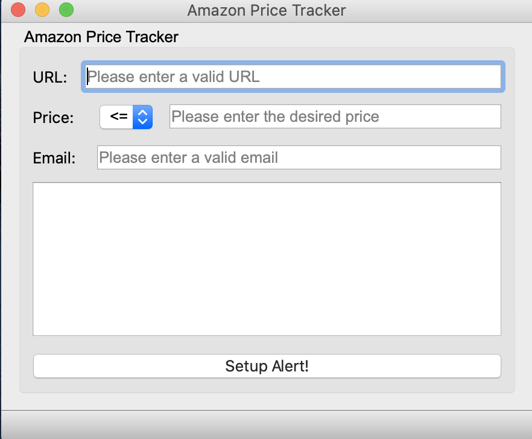
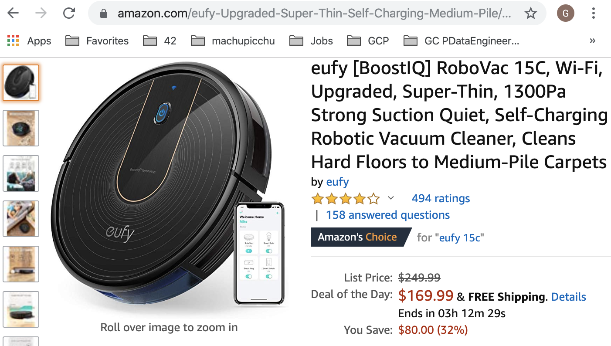
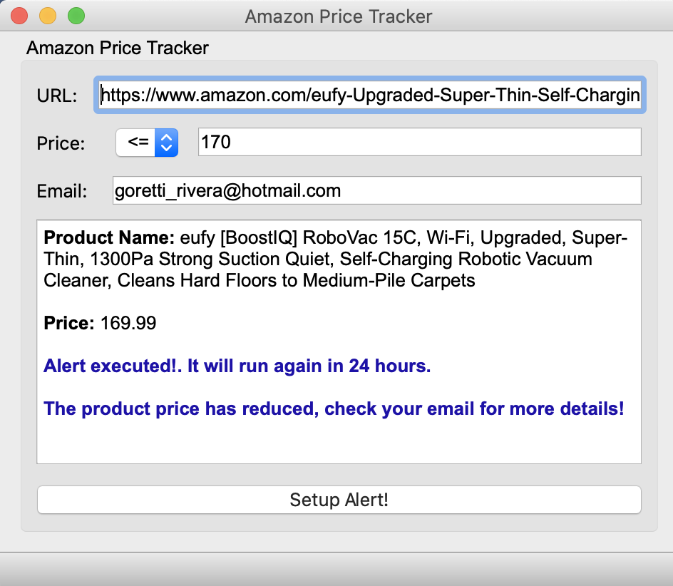
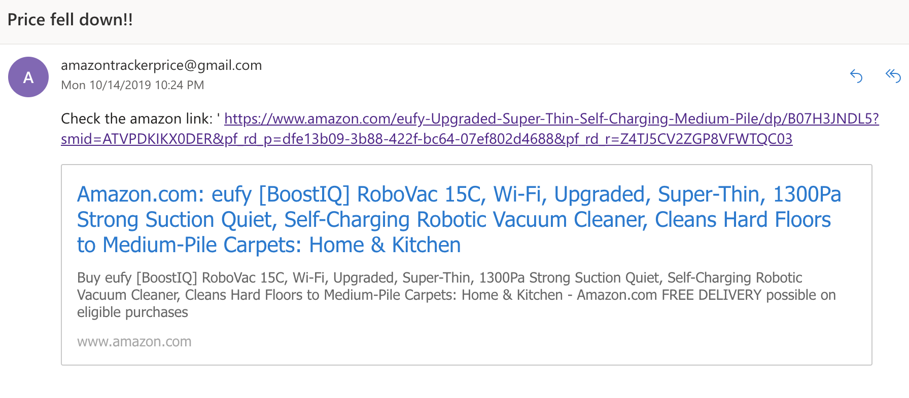

# 42-Wildcard Python Data Mining (Web Scraping with Beautiful Soup)

Build a Python App that tracks Amazon Prices!
We are using python to make requests and do web scraping on amazon website.

## How does it work?
This is an application to track Amazon Prices, it will send you an email alert when the item price has fell below the price setup by the user.

#### Parameter:

| Name   | Details                                                                                                                                        |
|--------|------------------------------------------------------------------------------------------------------------------------------------------------|
| URL:   | This has to be an amazon URL, go to amazon.com, select any item from which you would like to track the price, copy/paste URL in this field.    |
| Price: | Enter the desired price.                                                                                                                       |
| Email: | Enter your email.                                                                                                                              |

Once the parameters are filled, click on "Setup Alert". The alert will be setup and you will receive an email when the price fell below the price setup by the user.
The alert will run every day.

 

## Installation:

1. Install the latest version of Python 3:  https://www.python.org/downloads/
2. Install the following packages using pip:
   pip install requests, bs4, PyQt5
3. Run python on amazonApp.py and enjoy :)

## Sources:
* [Python Tutorial for Beginners](https://www.youtube.com/watch?v=_uQrJ0TkZlc&t=9090s)
* [Intro to Web Scraping with Python and Beautiful Soup](https://www.youtube.com/watch?v=XQgXKtPSzUI&t=2s)
* [PyQt5 Tutorial - Setup and a Basic GUI Application](https://www.youtube.com/watch?v=Vde5SH8e1OQ&list=PLzMcBGfZo4-lB8MZfHPLTEHO9zJDDLpYj)
